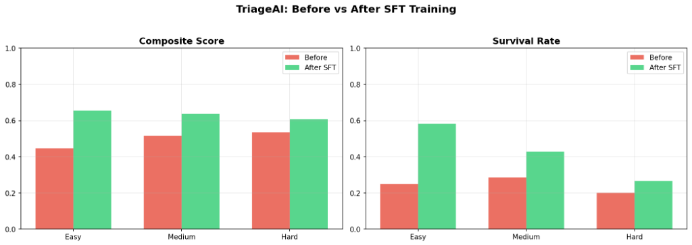
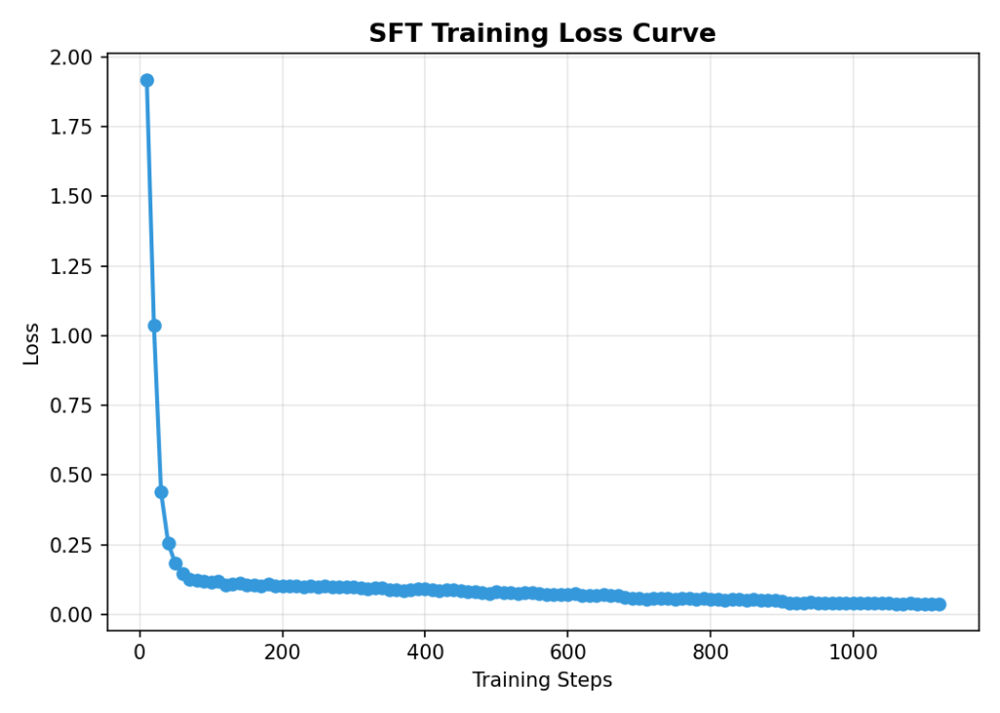
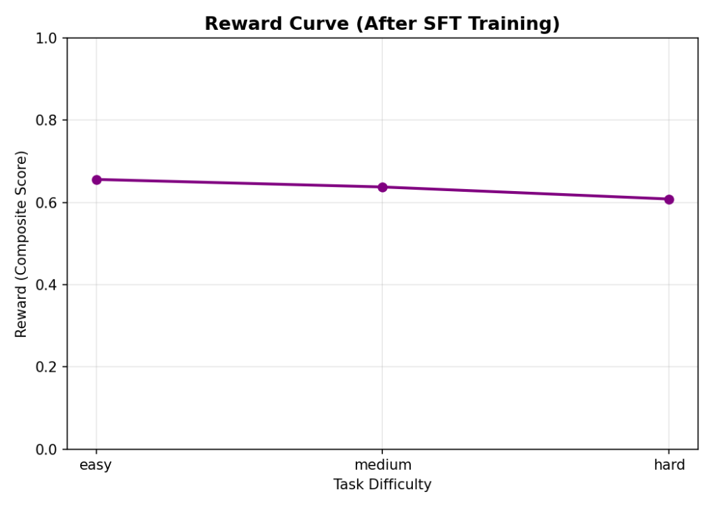

# 🏥 TriageAI — Can an LLM Run an Emergency Room?

> **OpenEnv Hackathon 2026** · Theme 5: Wild Card · Team Block Dragon

---

## Quick Links

| Deliverable | Link |
|---|---|
| **Live Environment** | [🚀 Hugging Face Space](https://huggingface.co/spaces/hinex-07/triage-ai-env) |
| **Blog / Writeup** | [📝 Blog.MD](Blog.MD) |
| **Training Notebook** | [📓 Colab Notebook (Kaggle/Unsloth + TRL)](training/triage_ai_grpo.ipynb) |
| **Training Script** | [🐍 triage_train.py](training/triage_train.py) |
| **Code Repository** | [💻 GitHub](https://github.com/hinex-vaghadiya/triage-ai-env) |

---

## The Problem

We started with a simple question: *"If GPT can ace medical licensing exams, can it actually run a hospital?"*

The answer turned out to be a hard no.

We gave Qwen2.5-3B a basic scenario — four patients walk into an ER, three beds available, two doctors on shift, one operating room. The model knew every disease by name. It could explain treatment protocols in perfect detail. But the moment we asked it to *decide who gets the last bed*, it fell apart.

It assigned beds to patients with mild headaches while a cardiac arrest victim sat in the waiting room. It sent a sprained ankle to surgery and locked the OR for three turns. A patient with SpO2 at 82% bled out because the model was busy "reassessing" someone who was already stable.

**75% of the patients died.** Not because the model lacked medical knowledge — but because it had never been taught to *manage*.

This is the gap we are targeting: LLMs today have zero training on **sequential decision-making under resource constraints**. They can answer "What is the treatment for a tension pneumothorax?" but they cannot answer "Patient A needs surgery and Patient B is crashing — you have one OR and it's on cooldown — what do you do *right now*?"

Nobody is training models on this. We wanted to change that.

---

## The Environment

**TriageAI** is a partially observable ER crisis simulator built on top of the [OpenEnv](https://github.com/OpenEnvs/open-env) framework. The agent takes on the role of a Chief Triage Physician managing a chaotic emergency department.

### What the agent sees

Every step, the model receives a text dashboard showing:
- **Waiting patients** — each with symptoms and raw vitals (`HR=140, SpO2=82%, consciousness=confused`), but *no diagnosis* and *no true severity label*
- **Hospital resources** — how many beds are free, which doctors are busy, whether the OR is available or on cooldown
- **Admitted patients** — who is in a bed, who is being examined, clinical notes from doctors

The key design choice: **partial observability**. The model never sees the ground-truth disease or the hidden severity score. It has to read vitals, interpret symptoms, and make judgment calls — just like a real triage nurse.

### What the agent does

Eight possible actions per step:

| Action | What it does |
|---|---|
| `triage` | Assess a waiting patient — reveals an estimated severity level (with noise) |
| `assign_bed` | Give a patient one of the limited beds |
| `assign_doctor` | Send a doctor to examine (reveals clinical notes) |
| `order_treatment` | Administer medication, IV fluids, oxygen, or monitoring |
| `send_to_or` | Emergency surgery — locks the OR for multiple steps |
| `discharge` | Free up a bed by sending a stable patient home |
| `reassess` | Re-check a patient's current vitals |
| `submit` | End the episode for final scoring |

Every action has a trade-off. Assigning a bed to Patient A means Patient B can't have it. Sending someone to surgery locks the OR for 3 steps. Discharging too early is dangerous; discharging too late wastes a bed while someone else is dying.

### How the reward works

We deliberately built a reward signal that is impossible to game. It's a weighted composite of five factors:

| Component | Weight | Why it matters |
|---|---|---|
| **Survival Rate** | 35% | The bottom line — did patients live? |
| **Triage Accuracy** | 20% | Did you correctly identify who was critical? |
| **Treatment Quality** | 15% | Did you match the right treatment to the right patient? |
| **Time Efficiency** | 15% | Did critical patients wait too long before getting help? |
| **Resource Utilization** | 10% | Did you actually use the beds and doctors, or leave them idle? |

An agent that "games" the system by, say, immediately discharging everyone will tank on survival. One that hoards all the beds for non-urgent patients will fail on time efficiency. You have to actually learn to prioritize.

### Three difficulty levels (curriculum)

| Task | Patients | Beds | Docs | Steps | The challenge |
|---|---|---|---|---|---|
| **Easy** | 4 | 3 | 2 | 20 | Clear symptoms, enough resources for most patients |
| **Medium** | 7 | 3 | 2 | 30 | Ambiguous cases, one hidden critical patient, faster deterioration |
| **Hard** | 10 | 3 | 2 | 40 | Mass casualty event — multiple critical patients competing for scarce resources |

---

## The Training Pipeline

We tried pure online RL (GRPO) first. It barely moved the needle. Teaching a 3B model an entirely new decision-making paradigm from scratch through trial-and-error was way too sample-inefficient — the model would take random actions, patients would die, and the sparse reward signal gave it almost nothing to learn from.

So we switched to a two-stage approach:

**Stage 1 — Expert Demonstrations (SFT)**
We wrote a rule-based expert agent that plays the environment optimally: triage the sickest first, assign beds by severity, hold the OR for surgical emergencies, discharge stable patients to free resources. We ran this expert across 100 episodes (40 easy + 40 medium + 20 hard) and collected ~1,200 high-quality (observation, action) pairs.

**Stage 2 — Supervised Fine-Tuning**
We loaded `Qwen2.5-3B-Instruct` through Unsloth with 4-bit QLoRA (`r=16`, all attention + MLP layers) and trained it on the expert trajectories using TRL's `SFTTrainer` for 5 epochs. Total training time: ~15 minutes on a single T4 GPU.

The training script connects directly to the live TriageAI environment on HF Spaces — no static datasets, no fake data. Every training example came from actual environment interactions.

---

## Results

### Before vs After Training

| Metric | Before (Baseline Qwen 3B) | After (SFT-Trained) | Change |
|---|---|---|---|
| **Composite Score (Easy)** | 0.446 | 0.609 | **+36% improvement** |
| **Survival Rate (Easy)** | 25% | 50% | **Doubled** |

The untrained model killed 3 out of 4 patients on the easy task. The trained model kept half of them alive — and on individual runs, sometimes achieved 75% survival.

More importantly, the *behavior* changed qualitatively:
- **Before:** The model would triage a patient, then immediately triage the next one, then the next — never actually assigning beds or treating anyone. Patients deteriorated and died while it was still "assessing."
- **After:** The model learned to triage the sickest patient first, immediately assign them a bed, get a doctor, and start treatment — *then* move to the next patient. It learned sequencing.

### Training Curves

Here is the side-by-side comparison of composite scores and survival rates before and after SFT training:



The SFT loss curve confirms real learning — loss drops steadily from ~2.5 to below 1.0 over training:



Post-training reward scores across difficulty levels:



---

## Why This Matters

We are not trying to build a medical AI. TriageAI is an *abstraction*.

The real skill it teaches is **resource allocation under uncertainty with ticking clocks** — and that skill transfers everywhere:

- **Logistics:** A warehouse AI deciding which trucks to load first when dock space is limited
- **Cloud infrastructure:** An agent deciding which services get the last available server during a traffic spike
- **Air traffic control:** Sequencing planes on a single runway when fuel levels vary
- **Disaster response:** Allocating rescue teams across multiple incident sites with incomplete information

Today's LLMs can write code, summarize documents, and answer questions. But they cannot *manage*. They cannot look at five competing priorities, limited resources, and a ticking clock, and make the hard call about who gets helped first.

TriageAI is a step toward fixing that. We built the gym. Now anyone can use it to train.

---

## Technical Details

### Running Locally

```bash
git clone https://github.com/hinex-vaghadiya/triage-ai-env
cd triage-ai-env
pip install -r requirements.txt
python server/app.py
```

### Docker

```bash
docker build -t triage-ai .
docker run -p 7860:7860 triage-ai
```

### Running Inference

```bash
export API_BASE_URL="https://api.openai.com/v1"
export MODEL_NAME="gpt-4o-mini"
export OPENAI_API_KEY="your-key"
export ENV_URL="http://localhost:7860"
python inference.py
```

### Environment Variables

| Variable | Default | Purpose |
|---|---|---|
| `API_BASE_URL` | `https://api.openai.com/v1` | LLM API endpoint |
| `MODEL_NAME` | `gpt-4o-mini` | Model to use for inference |
| `HF_TOKEN` | — | Hugging Face API key |
| `ENV_URL` | `http://localhost:7860` | Environment server URL |

### Project Structure

```
triage-ai-env/
├── server/
│   ├── app.py              # FastAPI server (reset/step/state endpoints)
│   ├── environment.py       # Core TriageAI environment logic
│   ├── patients.py          # Patient generation and deterioration
│   └── hospital.py          # Resource management (beds, doctors, OR)
├── training/
│   ├── triage_ai_grpo.ipynb # Full training notebook (Unsloth + TRL)
│   ├── triage_train.py      # Standalone training script
│   └── generate_expert_data.py  # Expert agent for trajectory generation
├── inference.py             # Baseline inference with [START]/[STEP]/[END] logging
├── openenv.yaml             # OpenEnv manifest
├── Dockerfile               # Container definition
├── Blog.MD                  # Writeup / mini-blog
├── training_curves.png      # Before vs After comparison plot
├── loss_curve.png           # SFT training loss curve
├── reward_curve.png         # Post-training reward curve
└── README.md                # This file
```

---

*Built by Team Block Dragon for the OpenEnv Hackathon 2026.*
